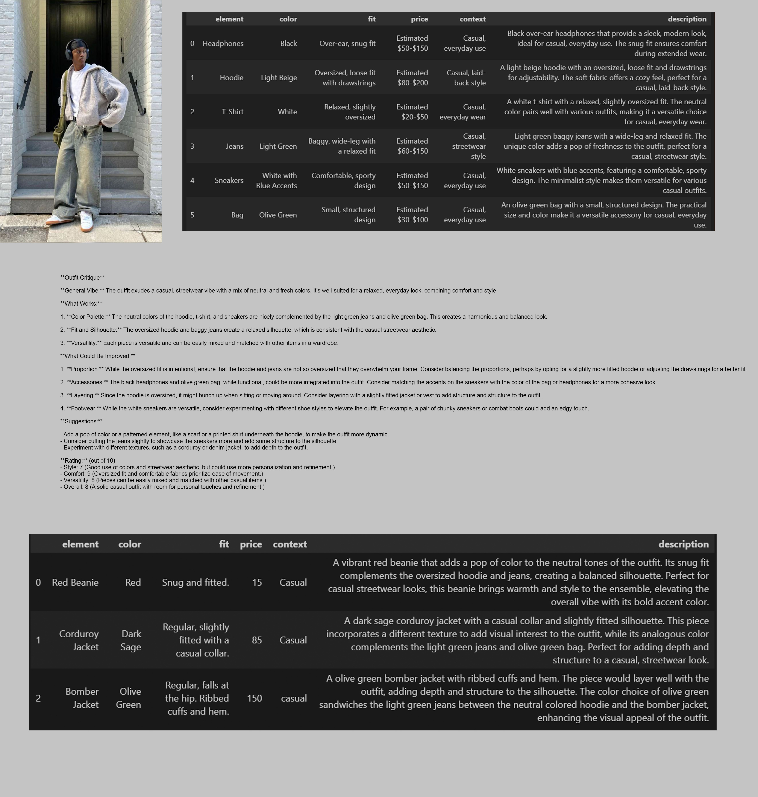
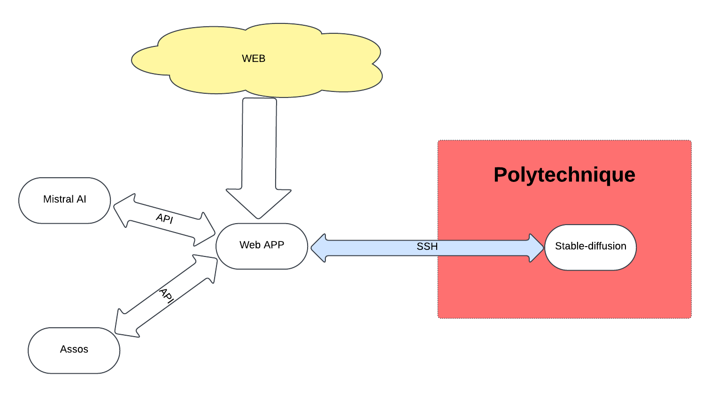
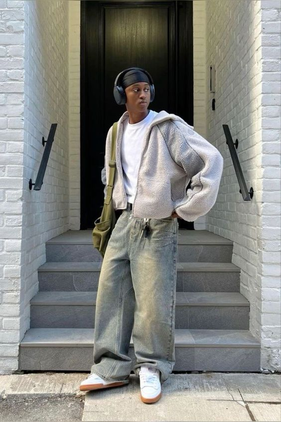
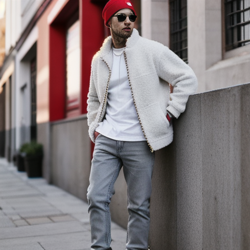
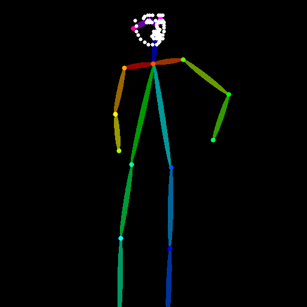

# RelookX

## 0. Introduction:
RelookX est une plateforme en ligne complète pour gérer vos vêtements, augmenter la créativité de vos tenues tout en restant à la mode et fidèles à votre style.

Cet assistant personnel apprend à connaître votre style et votre garde-robe à partir des photos de vos meilleures tenues, et vous propose ensuite des nouvelles pièces à ajouter à votre collection pour faire passer votre style au niveau supérieur!

Vous n'êtes pas sur de vouloir acheter la pièce qu'il recommande?

Aucun soucis, votre assistant personnel va lui-même générer une photo de vous avec ce vêtement pour vous montrer qu'il ne se trompe vraiment jamais!

## 1. Fonctionnement
L'interface consiste en un espace de chat avec votre assistant. Le bouton **upload image** vous permet de lui envoyer des photos de vos tenues.

Une fois la photo reçue, elle est process par Pixtral qui en extrait une description de chanque vêtement et la stocke dans votre garde-robe. La photo est quand à elle ajoutée à l'onglet "vos images".

## 1.0 Se connecter au site

#### 1.0.1 Instructions pour se connecter au site

1. **Accéder au site**  
   Rendez-vous sur l'URL suivante :  
   👉 [http://devops.tlapp.net](http://devops.tlapp.net)

2. **Se connecter**  
   Utilisez les identifiants suivants :  
   - **Nom d'utilisateur** : `6freds`  
   - **Mot de passe** : `6freds`  

---

##### Limitation actuelle
La fonction de génération d'image **ne sera pas disponible** car elle nécessite l'utilisation des identifiants Polytechnique pour fonctionner correctement.

#### 1.0.2 Lancer le Git

```bash
   git clone https://github.com/Kewij/RetailX7.git
   cd RetailX7/src/app/retailx7
   pip3 install -r requirements.txt
   python3 manage.py migrate
   python3 manage.py runserver 0.0.0.0:8000 &
```

### 1.1. Génération d'une recommandation

Le chatbot est designé pour répondre à des sollicitations de conseils, suite à des prompts du type **"Can you recommend a clothe to match image number 7 ?"** ou similaire.

Il ira chercher la garde-robe associée à l'image mentionnée, et l'analysera pour en générer un vêtement qui complèterait la tenue en suivant des règles d'esthétique et de mode définies au préalable. Si aucune image n'est mentionnée, il ira chercher l'ensemble e la garde-robe de l'utilisateur.

Il est également possible de préciser sa demande, en demandant un type de vêtement ou une couleur en particulier.

Une fois la recommandation faite, il fera appel à un scrapper internet pour aller chercher un vêtement correspondant à la description générée sur un site de e-commerce et proposera directement à l'utilisateur de faire l'achat.

### 1.2. Génération d'une preview

Une phrase du type **"Can you generate a preview of the new outfit ?"** permet également à l'utiliateur de demander à son assistant de générer une image ressemblant à l'image modèle, mais en y ajoutant le vêtement recommandé. Cette génération se fait via l'appel de stable diffusion par notre llm.

[détailler]

## 2. Aspects techniques
### 2.1. Recommandations

Rendre le système de recommandations créatifs et pertinent n'est pas aisé. En effet, le modèle est très prédicitible suite à un simple prompt et recommande les mêmes vêtements et couleurs en boucle, en prenant peu en compte les spécificités de la tenue.

Un workflow particulier a été développé pour arriver à plus de personnalisation:

-> Pixtral est mis dans le rôle d'un critique de mode par un ruleset précis et détaillé (src/app/retailx7/Home/ia_files/guides) pour développer la qualité de ses analyses de tenues.

-> Lorsqu'on lui fournit une description de tenue, Mistral commence par se mettre dans la peau d'un critique et génère un texte de moyenne longueure critiquant la tenue, selon un format bien précis, et fournissant des pistes d'amélioration.

-> Ensuite, une autre instance de Mistral, mise dans la peau d'un conseiller en relooking, lit cette critique de la tenue et en déduit un élément à ajouter pour l'améliorer.

C'est cet élément final qui sera renvoyé à l'utilisateur, la plupart des étapes étant invisibles du point de vue du front-end. Ceci permet au modèle de prendre en compte le contexte, l'esprit, le style des tenues et de proposer des suggestions argumentée et justifiés pour les changer.

Voir le fichier **workflow_example.jpg** pour visualiser chaque étape.


### 2.2. Fine-tuning

Le workflow décrit précédemment est relativement coûteux (~30s pour une suggestion).
L'idée originale était de fine-tuner un modèle mistral-small à cette tâche pour rendre transparentes les phases de mise en contexte et de génération de critique.

Le modèle fine-tuné aurait dû, à partir de descriptions de tenues, donner directement le vêtement à y ajouter.

A cette fin, un dataset de fine-tuning a été généré, composé de nombreuses entrée et sorties du workflow détaillé précédemment (/src/pixtral/data_gen.ipynb, /src/pixtral/data).

Malheureusement, les tâches de fine-tuning n'étaient pas réalisables sur la plate-forme de Mistral pendant la plupart du hackathon ce qui nous a empêché de le mener à bout, et le site final incorpore donc le workflow plus lent. Le plus gros du travail de fine-tuning, en particulier la génération de data a néanmoins été faite.

### 2.3. Site internet et serveurs



Le site est héberger sur un serveur distant sans carte graphique, entièrement en Django, en version test. Il se connect aux différents services pour répondre aux demanders : mistral, api asos, serveur de stable-diffusion.

En effet, le serveur ne permettait pas disposer du stable-diffusion en local, il a ainsi été mis sur un autre serveur (celui de polytechnique), et un transfert de port entre le serveur de la webapp et celui du stable-diffusion a été réalisé avec le protocole ssh en utilisant des identifiants de polytechnique.

### 2.4. Stable diffusion

Pour la génération d'une preview il a été décidé d'utiliser la webui de stable diffusion.

Nous souhaitions pouvoir générer une image répondant aux attentes de l'utilisateur, c'est-à-dire utiliser une de ses photos et ajouter la recommandation du LLM sur la photo tout en conservant une cohérence.

En effet, nous avons essayé deux technologies : ControlNet et Advisalier. La première permet de bien correspondre à la position et d'aider Stable Diffusion à positionner correctement les éléments proposés par le LLM, tandis qu'Advisalier permet d'obtenir un rendu avec un visage de meilleure qualité.

Comme montré sur l'exemple ci dessous, à partir d'une image de l'utilisateur, image du haut, ControlNet extrait une pose, image du dessous, et tente de faire correspondre son output à celle ci. 
En donnant comme prompt la description des vêtements générée par Pixtral ainsi que la description du vêtement suggéré, ici un bonnet rouge, on arrive à réaliser une prévisualisation convainquante du nouvel outfit.





Ainsi, un prompt utilisateur est censé déclencher la génération d'une image à l'aide de ces technologies, en y ajoutant un contexte grâce au LLM.

En local, nous avons réussi à implémenter la génération d'images avec Advisalier et ControlNet.

Helas, en voulant porter notre solution vers notre serveur Django nous avons rencontré un certain nombre de problèmes techniques. 
L'installation de stable diffusion nécessite une carte graphique que notre serveur n'a pas. 
Nous avons alors décidé d'installer stable diffusion sur une des machines des salles informatiques de l'école polytechnique et de nous y connecter en SSH. 
En créant un tunnel ssh et en utilisant les bons arguments de configuration de la webui il a été possible de faire communiquer le code python, hébergé sur le serveur, et la webui, hébergée sur la machine de l'école. 

Cependant, n'ayant pas les droits d'administrateur sur la machine de l'école et certaines extensions de stable diffusion étant assez exigeante quant à la version de python à utiliser, nous n'avons pas réussi à y installer Control Net, ce qui réduit la qualité de nos previews.
